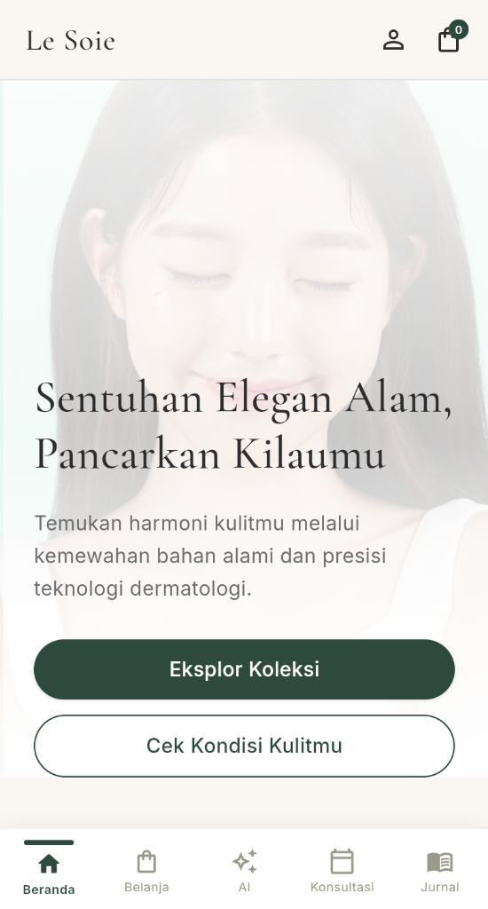
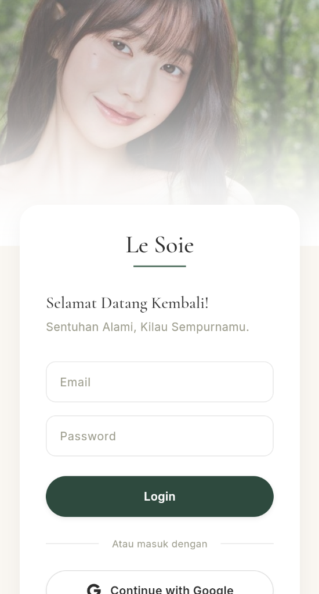
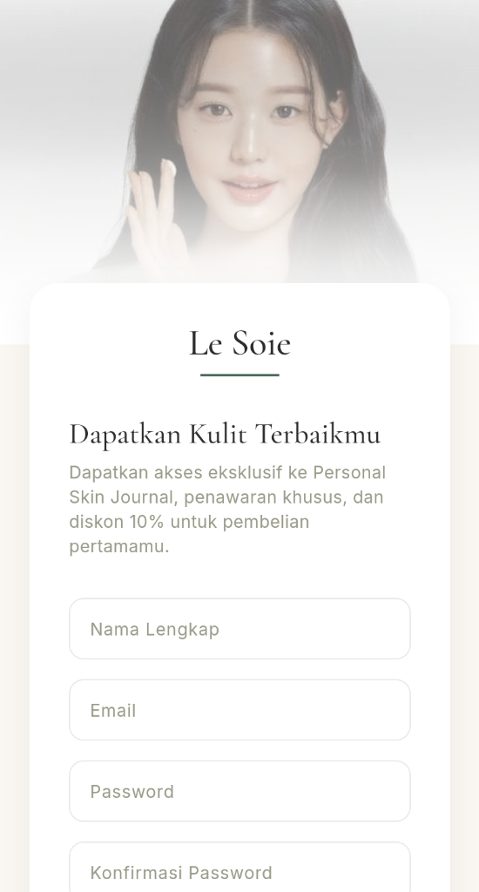
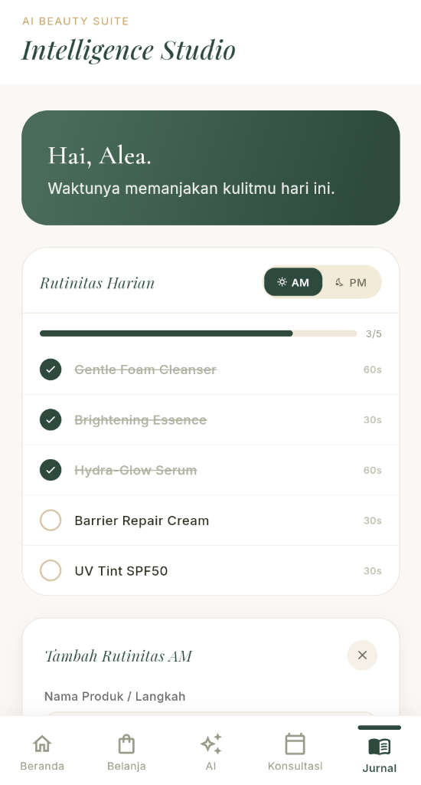

<div align="center">

<br/>

```
 ██╗     ███████╗    ███████╗ ██████╗ ██╗███████╗
 ██║     ██╔════╝    ██╔════╝██╔═══██╗██║██╔════╝
 ██║     █████╗      ███████╗██║   ██║██║█████╗  
 ██║     ██╔══╝      ╚════██║██║   ██║██║██╔══╝  
 ███████╗███████╗    ███████║╚██████╔╝██║███████╗
 ╚══════╝╚══════╝    ╚══════╝ ╚═════╝ ╚═╝╚══════╝
```

**Beauty Care & Clinic — Mobile App**

*Merawat kulitmu dengan sentuhan kecantikan yang personal*

<br/>


</div>

---

## ✨ Tentang Le Soie

**Le Soie** adalah aplikasi kecantikan & klinik perawatan kulit yang hadir untuk menemani perjalanan perawatan kulitmu sehari-hari. Dirancang dengan estetika yang elegan dan pengalaman pengguna yang intuitif, Le Soie membantu kamu membangun rutinitas perawatan kulit yang konsisten dan personal.

> *"Kulit sehat bukan tentang kesempurnaan, tapi tentang konsistensi."*

---

## 🖼️ Tampilan Aplikasi

<div align="center">

| 🏠 Beranda | 🔐 Login |
|:---:|:---:|
|  |  |
| Hero section dengan foto & tombol CTA | Background foto + form login elegan |

| 📝 Register | 📓 Jurnal Rutinitas |
|:---:|:---:|
|  |  |
| Form registrasi dengan benefit eksklusif | Checklist AM/PM + form tambah rutinitas |

</div>

---

## 🚀 Fitur Utama

### ✅ Sudah Tersedia
| Fitur | Deskripsi |
|---|---|
| 🔐 **Authentication** | Halaman login & registrasi dengan Google & Apple sign-in |
| 🏠 **Home Screen** | Hero banner, highlights ingredient, & informasi klinik |
| 📓 **Jurnal Rutinitas** | Pelacak rutinitas harian AM/PM dengan progress bar & checklist interaktif |
| ➕ **Tambah Rutinitas** | Tambah langkah perawatan baru secara inline tanpa pindah halaman |
| 🧭 **Navigasi 5 Tab** | Beranda · Belanja · AI · Konsultasi · Jurnal |

### 🔜 Segera Hadir
| Fitur | Deskripsi |
|---|---|
| 🛍️ **Belanja** | Katalog produk Le Soie dengan sistem keranjang |
| 🤖 **AI Beauty Suite** | Analisis warna & kondisi kulit berbasis AI |
| 📅 **Konsultasi** | Jadwalkan konsultasi langsung dengan ahli kulit |

---

## 🗂️ Struktur Proyek

```
le-soie/
├── lib/
│   ├── main.dart                    # Entry point aplikasi
│   ├── core/
│   │   └── theme/
│   │       ├── app_colors.dart      # Palet warna (hijau sage, krem, gold)
│   │       └── app_theme.dart       # Konfigurasi tema global
│   ├── screens/
│   │   ├── login_screen.dart        # Halaman login
│   │   ├── register_screen.dart     # Halaman registrasi
│   │   ├── main_screen.dart         # Shell navigasi utama (IndexedStack)
│   │   ├── home_screen.dart         # Halaman beranda
│   │   └── jurnal_screen.dart       # Halaman jurnal rutinitas
│   └── widgets/
│       ├── custom_button.dart       # Komponen tombol reusable
│       └── custom_text_field.dart   # Komponen input reusable
├── assets/
│   ├── images/                      # Gambar hero & background
│   │   ├── Home.png
│   │   ├── Login.png
│   │   ├── Register.png
│   │   └── ...
│   └── icons/                       # Icon SVG
│       └── gg_google.svg
└── pubspec.yaml
```

---

## 🎨 Design System

### Palet Warna
| Token | Warna | Hex | Penggunaan |
|---|:---:|---|---|
| `primaryGreen` | 🟢 | `#2D4A3E` | CTA, icon aktif, aksen |
| `primaryGreenLight` | 🟩 | `#4A6B5A` | Gradient, hover |
| `accentGold` | 🟡 | `#B89B6A` | Label premium, divider |
| `background` | ⬜ | `#FAF8F5` | Background utama |
| `backgroundDarker` | 🟫 | `#F0E8DC` | Kartu, section |
| `textDark` | ⬛ | `#2A2A1E` | Teks utama |
| `textGray` | 🔘 | `#9A9A8A` | Teks sekunder |

### Tipografi
| Peran | Font | Gaya |
|---|---|---|
| Display / Logo | **Playfair Display** | Italic, elegant |
| Heading | **Cormorant Garamond** | Serif, premium |
| Body / UI | **Inter** | Sans-serif, clean |

---

## ⚙️ Cara Menjalankan

### Prasyarat
- Flutter SDK `^3.x`
- Dart SDK `^3.12.0`
- Chrome (untuk Flutter Web)

### Langkah Instalasi

```bash
# 1. Clone repository
git clone https://github.com/Sisilfr/Le-Soie.git
cd le-soie

# 2. Install dependencies
flutter pub get

# 3. Jalankan di browser (web)
flutter run -d chrome

# 4. Atau jalankan di emulator Android/iOS
flutter run
```

### Build Production

```bash
# Build APK
flutter build apk --release

# Build iOS
flutter build ios --release

# Build Web
flutter build web --release
```

---

## 📦 Dependencies

| Package | Versi | Kegunaan |
|---|---|---|
| `google_fonts` | `^8.1.0` | Tipografi premium (Playfair, Inter, Cormorant) |
| `flutter_svg` | `^2.0.10+1` | Render icon SVG (Google, dll) |
| `cupertino_icons` | `^1.0.8` | Icon set iOS style |

---

## 🤝 Kontribusi

1. Fork repository ini
2. Buat branch fitur baru: `git checkout -b feature/nama-fitur`
3. Commit perubahan: `git commit -m 'feat: tambah fitur X'`
4. Push ke branch: `git push origin feature/nama-fitur`
5. Buat Pull Request

---

## 📄 Lisensi

Proyek ini bersifat privat dan dikembangkan untuk keperluan **Le Soie Beauty Care & Clinic**.

---

## 👩‍💻 Author

<div align="center">

<br/>

| | |
|:---:|:---|
| 👤 | **Suci Fransisca Sisilia** |
| 🎓 | Data Science |
| 🔗 | [github.com/Sisilfr](https://github.com/Sisilfr) |

<br/>

</div>

---

<div align="center">

Made with ❤️ & Flutter

*Le Soie — Beauty Care & Clinic*

</div>
