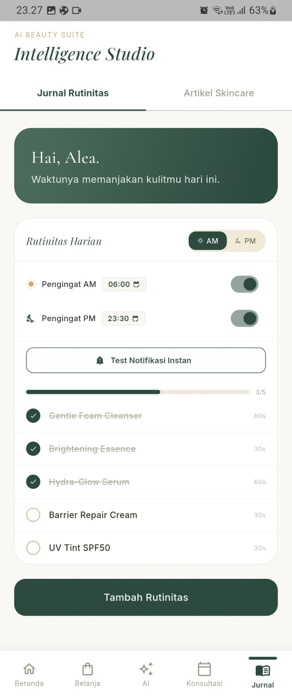
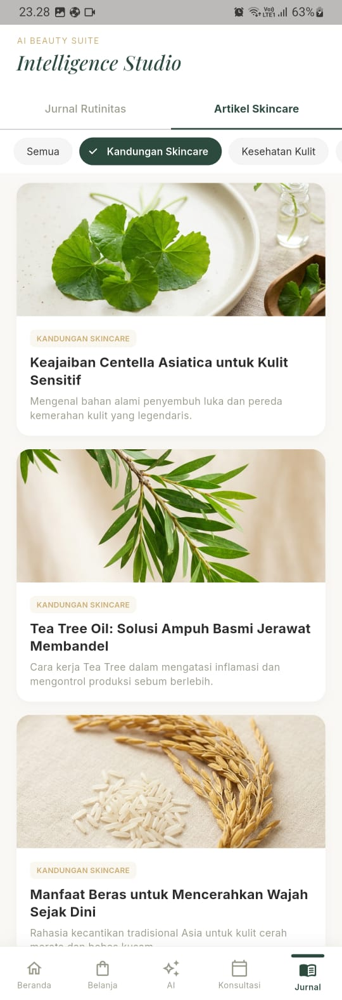
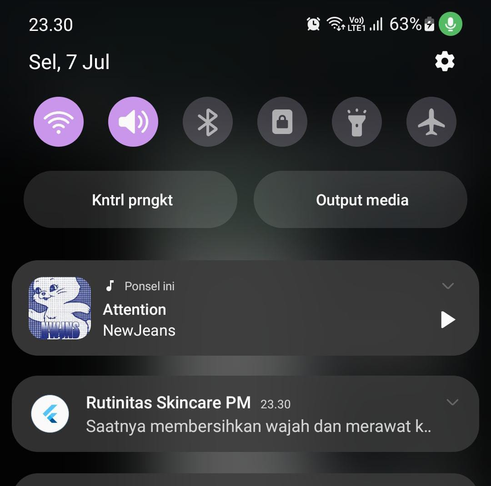

<div align="center">

<br/>

```
 ██╗     ███████╗    ███████╗ ██████╗ ██╗███████╗
 ██║     ██╔════╝    ██╔════╝██╔═══██╗██║██╔════╝
 ██║     █████╗      ███████╗██║   ██║██║█████╗  
 ██║     ██╔══╝      ╚════██║██║   ██║██║██╔══╝  
 ███████╗███████╗    ███████║╚██████╔╝██║███████╗
 ╚══════╝╚══════╝    ╚══════╝ ╚═════╝ ╚═╝╚══════╝
```

**Beauty Care & Clinic — Mobile App**

*Merawat kulitmu dengan sentuhan kecantikan yang personal*

<br/>


</div>

---

## ✨ Tentang Le Soie

**Le Soie** adalah aplikasi kecantikan & klinik perawatan kulit yang dirancang untuk menemani perjalanan perawatan kulitmu sehari-hari. Aplikasi ini dibangun untuk UAS Mobile Computing dengan fokus pada arsitektur bersih (MVC ringan), manajemen state (Provider), integrasi API eksternal (DummyJSON), penyimpanan lokal (SharedPreferences), dan fitur perangkat keras mobile (Local Notification).

> *"Kulit sehat bukan tentang kesempurnaan, tapi tentang konsistensi."*

---

## 🎨 Link Desain Figma

> [!IMPORTANT]
> Desain UI/UX Le Soie Clinic dapat diakses pada tautan berikut (Pastikan link di-set ke "Anyone with the link can view"):
> 🔗 **[Link Desain Figma Le Soie](https://www.figma.com/design/A2wpRFrpgfeotgcHZy7RQU/Le-Sole?node-id=2-7&t=k2klQkE6IywkM3Cf-1)**

---

## 🖼️ Tampilan Aplikasi

<div align="center">

| 🏠 Beranda | 🔐 Login |
|:---:|:---:|
|  |  |
| Hero section dengan foto & tombol CTA | Form login elegan terhubung SharedPreferences |

| 📝 Register | 📓 Jurnal Rutinitas |
|:---:|:---:|
|  |  |
| Form registrasi dengan benefit eksklusif | Jurnal Rutinitas — Checklist AM/PM, pengingat, dan progress harian |

| 🛍️ Belanja Skincare | ⏰ Set Jam Pengingat |
|:---:|:---:|
|  |  |
| | Time Picker kustom untuk pengingat manual |

| 📚 Artikel Skincare | 🔔 Notifikasi Pengingat |
|:---:|:---:|
|  |  |
| Artikel Skincare — Tab kedua di halaman Jurnal, filter kategori (Kandungan Skincare, Kesehatan Kulit) | Notifikasi Reminder PM — Muncul di status bar HP sesuai jadwal terjadwal |

</div>

---

## 🚀 Fitur Utama & UAS Rubrik

Aplikasi **Le Soie** telah ditingkatkan dengan fitur-fitur wajib berikut untuk Rubrik Penilaian UAS:

1. **State Management (Provider)**
   - Menggunakan package `provider` untuk memisahkan logic UI dengan bisnis.
   - Terdiri dari 4 provider utama: `AuthProvider`, `RoutineProvider`, `ProductProvider`, dan `NotificationProvider`.
2. **API Integration (DummyJSON)**
   - Halaman **Belanja** mengambil data secara realtime dari API `https://dummyjson.com/products/category/skincare`.
   - Menampilkan daftar produk (thumbnail, kategori, nama, harga USD, rating) dengan grid view yang responsif, dilengkapi loading indicator, pesan error, serta tombol **Coba Lagi**.
   - Dilengkapi popup detail produk (Bottom Sheet) berisi deskripsi lengkap, rating, dan harga produk.
   - Catatan: aplikasi ini tidak mengimplementasikan fitur keranjang belanja (cart) maupun checkout sungguhan. Tombol "Beli Sekarang" hanya sebagai simulasi UI (menampilkan notifikasi singkat/SnackBar), karena fokus fitur perangkat pada UAS ini diarahkan ke Local Notification (lihat poin 4), bukan fitur e-commerce.
3. **Local Storage (SharedPreferences)**
   - Menyimpan status login pengguna (`isLoggedIn`).
   - Fitur **Auto-Login** mendeteksi status login saat aplikasi dimulai via `SplashScreen` dan mengarahkan pengguna secara otomatis ke halaman utama jika status login bernilai `true`.
   - Mengintegrasikan fungsi **Logout** di halaman Beranda (mengklik ikon Profil akan memunculkan dialog konfirmasi keluar dan menghapus status login).
4. **Mobile Feature (Local Notification)**
   - Menggunakan package `flutter_local_notifications` dan `timezone`.
   - Pengingat rutinitas harian untuk pagi (**AM**) dan malam (**PM**).
   - **Kustomisasi Waktu Manual**: Pengguna dapat mengaktifkan/menonaktifkan pengingat menggunakan Switch dan menyesuaikan jam pengingat harian secara manual melalui Time Picker yang elegan. Preferensi status dan waktu pengingat ini disimpan di penyimpanan lokal agar tetap persisten setelah aplikasi ditutup.
5. **Artikel Skincare (Konten Edukasi)**
    - Terintegrasi di dalam halaman **Jurnal** menggunakan TabBar yang elegan (Tab 1: Jurnal Rutinitas, Tab 2: Artikel Skincare).
    - Memuat daftar artikel edukasi kesehatan kulit, kandungan skincare, dan kebiasaan sehat.
    - Data disimulasikan secara asinkron (`Future.delayed`) untuk merefleksikan pemanggilan API riil.
    - Dilengkapi filter kategori yang interaktif (Semua, Kandungan Skincare, Kesehatan Kulit, Kebiasaan Sehat) serta tampilan detail artikel yang responsif menggunakan Modal Bottom Sheet.

---

## 🗂️ Arsitektur Aplikasi (MVC Ringan)

Struktur folder proyek diorganisasi dengan pola arsitektur **MVC Ringan** untuk pemisahan tugas yang jelas:

```
lib/
├── main.dart                    # Entry point aplikasi & MultiProvider setup
├── core/
│   └── theme/
│       ├── app_colors.dart      # Palet warna (hijau sage, krem, gold)
│       └── app_theme.dart       # Konfigurasi tema global
├── models/
│   ├── routine_item.dart        # Model data rutinitas
│   ├── product.dart             # Model data produk dari DummyJSON API
│   └── article.dart             # Model data artikel skincare
├── services/
│   ├── auth_storage_service.dart # Layanan SharedPreferences status login
│   ├── product_api_service.dart  # Layanan HTTP fetch data DummyJSON
│   ├── notification_service.dart # Layanan inisialisasi & penjadwalan notifikasi local
│   └── article_service.dart     # Layanan penyuplai data artikel skincare dummy
├── providers/
│   ├── auth_provider.dart        # State login/logout & auto-login check
│   ├── routine_provider.dart     # State manajemen daftar rutinitas AM/PM
│   ├── product_provider.dart     # State produk skincare, loading, & error handling
│   ├── notification_provider.dart # State status pengingat & kustomisasi jam manual
│   └── article_provider.dart     # State manajemen artikel, loading & error
├── screens/
│   ├── login_screen.dart        # Layanan login terhubung AuthProvider
│   ├── register_screen.dart     # Halaman pendaftaran akun
│   ├── main_screen.dart         # Penampung navigasi 5 tab utama
│   ├── home_screen.dart         # Halaman beranda terintegrasi tombol logout
│   ├── belanja_screen.dart      # Halaman katalog produk realtime
│   └── jurnal_screen.dart       # Halaman jurnal rutinitas & kustomisasi alarm
└── widgets/
    ├── custom_button.dart       # Komponen tombol reusable
    ├── custom_text_field.dart   # Komponen input text reusable
    └── product_card.dart        # Komponen kartu produk premium
```

---

## ⚙️ Cara Menjalankan Aplikasi

### Prasyarat
- Flutter SDK `^3.x`
- Dart SDK `^3.12.0`

### Langkah Instalasi & Run

```bash
# 1. Masuk ke direktori project
cd le-soie-main

# 2. Install dependensi
flutter pub get

# 3. Jalankan di emulator / device fisik
flutter run
```

### Build Production

```bash
# Build APK Release
flutter build apk --release
```

---

## 📦 Dependensi Utama

| Package | Versi | Kegunaan |
|---|---|---|
| `provider` | `^6.1.2` | Manajemen state terpusat (ChangeNotifier) |
| `http` | `^1.2.2` | Komunikasi HTTP dengan API DummyJSON |
| `shared_preferences` | `^2.3.2` | Penyimpanan lokal status login & preferensi alarm |
| `flutter_local_notifications` | `^18.0.1` | Penjadwalan alarm pengingat mobile lokal |
| `timezone` | `^0.9.4` | Inisialisasi zona waktu untuk notifikasi terjadwal |
| `flutter_timezone` | `^5.1.0` | Membaca nama zona waktu asli dari perangkat (e.g. Asia/Jakarta) |
| `google_fonts` | `^8.1.0` | Tipografi premium (Playfair Display, Inter) |
| `flutter_svg` | `^2.0.10+1` | Render icon vektor (Google SVG) |

---

## 📄 Catatan Penilaian Dosen / Penguji
- **Sumber Data API**: Produk diimpor dari endpoint `https://dummyjson.com/products/category/skincare` (kategori kosmetik/skincare).
- **Format Mata Uang**: Menggunakan format **USD ($)** sesuai dengan data asli dari DummyJSON.
- **Mobile Feature yang Dipilih**: Local Notification (bukan Camera), digunakan untuk pengingat rutinitas skincare AM/PM.
- **Fitur Keranjang Belanja**: Halaman Belanja pada aplikasi ini berfungsi sebagai katalog produk (integrasi REST API) dan tidak dilengkapi fitur keranjang belanja/cart maupun proses checkout nyata, karena fitur perangkat yang diimplementasikan untuk memenuhi rubrik UAS adalah Local Notification, bukan fitur e-commerce.
- **Konfigurasi Notifikasi Android**: Permissions `POST_NOTIFICATIONS` dan `SCHEDULE_EXACT_ALARM` telah ditambahkan di file `AndroidManifest.xml` bersama dengan meta-data default icon.

---

## 👩‍💻 Author

<div align="center">

| 👤 **Suci Fransisca Sisilia** |
|:---|
| 🎓 Program Studi: Data Science |
| 🔗 GitHub: [github.com/Sisilfr](https://github.com/Sisilfr) |

<br/>

Made with ❤️ & Flutter

*Le Soie — Beauty Care & Clinic*

</div>
